## Installation of Ubuntu
### Download
You can download the version Ubuntu 22.04.5 LTS (Jammy Jellyfish) for free from [this link](https://releases.ubuntu.com/22.04/?_gl=1*1ke0b85*_gcl_au*NTMxMTY4NzAuMTcyODQxODcyMA..&_ga=2.196916911.2032042906.1728418720-2114037748.1719220492). 

After clicking the link, make sure to select the Desktop image option from the download options. 
We won't be installing the server version, so the required ISO file for our installation is under the Desktop image option.
We are choosing the Desktop image because our setup does not require server functionalities, and the Desktop version provides a graphical interface that is more suitable for the tasks we'll be working on.

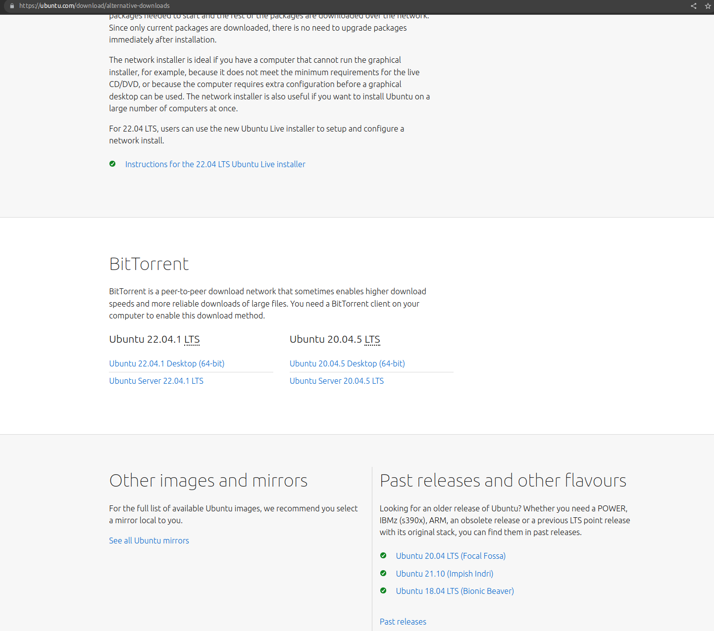

An ISO file will be downloaded.

### Download Rufus
We need to write the Ubuntu ISO file to a flash drive using [Rufus](https://github.com/ismailhos3/CP2024/blob/main/rufus.md).
Use [this link](https://rufus.ie/en/) to download Rufus.

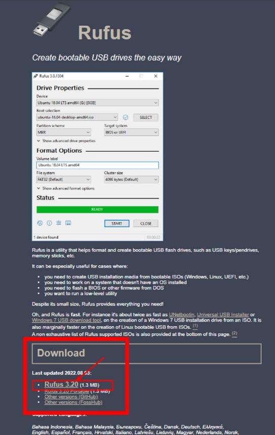

Run Rufus and write your Ubuntu 22.04 iso file to your flash memory as in the images below.

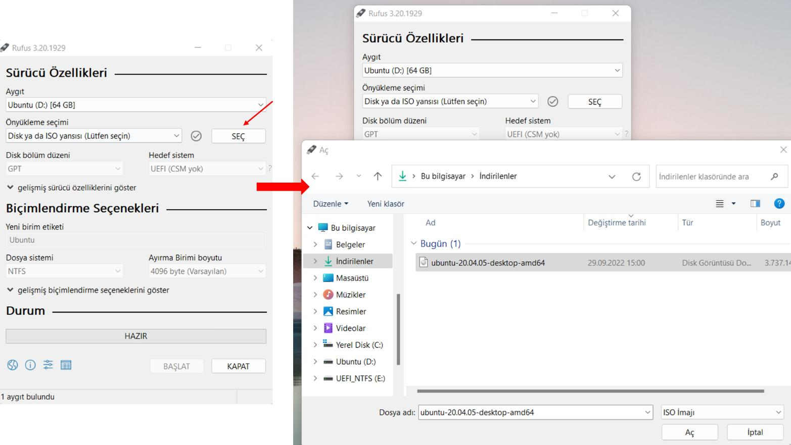
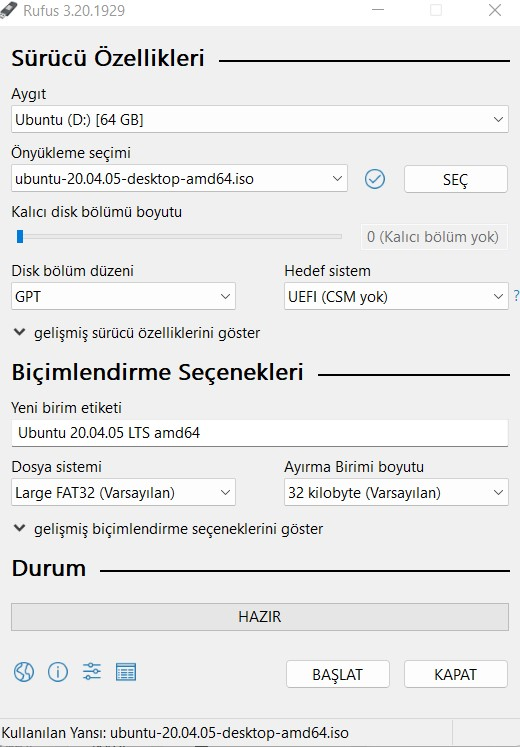

### Installation Options
There are three main methods to install Ubuntu alongside Windows:

**1. Creating Unallocated Space Using Disk Management Before Installation:**

**Step 1:** 
Open the "Disk Management" tool in Windows to shrink one of your existing disk partitions, creating unallocated space.

**Step 2:** 
Insert a bootable USB drive with Ubuntu and restart your computer. During the installation, select the "Install Ubuntu alongside Windows" option.

**Step 3:** 
Ubuntu will automatically detect the unallocated space and install itself there.

**Note:** 
In this method, you manually allocate disk space in Windows, so there's no need for additional partitioning during the Ubuntu installation.

**2. Allocating Disk Space During Ubuntu Installation:**

**Step 1:** 
Insert a bootable USB drive with Ubuntu and restart your computer. 
Choose the "Install Ubuntu alongside Windows" option.

**Step 2:** 
During the installation process, you'll encounter a disk allocation screen. 
Use the slider to determine how much disk space you want to allocate to Windows and Ubuntu.

**Step 3:** 
After setting the desired disk space, follow the standard installation steps to complete the process.

**Note:** 
This method allows you to allocate disk space directly during the Ubuntu installation.

**3. Leaving Unallocated Space During Windows Installation:**

**Step 1:** 
When installing or reinstalling Windows (or on a new computer without an operating system), during the disk partitioning stage, create an unallocated disk space without assigning it a drive letter or formatting it.

**Step 2:** 
Proceed with the Windows installation on the allocated partition.

**Step 3:** 
After Windows is installed, insert a bootable USB drive with Ubuntu and restart your computer.
Choose the "Install Ubuntu alongside Windows" option.

**Step 4:** 
Ubuntu will automatically detect the unallocated space and install itself there.

**Note:** 
This method helps prevent potential conflicts by planning the disk partitioning from the beginning.

### Which Method Should You Choose?

**Method 3 (Leaving Unallocated Space During Windows Installation):**

If you have the opportunity to set up your system from scratch, this method offers the cleanest and most trouble-free installation process. 
By clearly separating disk spaces from the start, you minimize potential future conflicts between Windows and Ubuntu.

**Other Methods: (Method 1 and Method 2)** 

For those who prefer to keep their existing Windows installation and avoid reinstalling Windows—along with the hassle of backing up files and reinstalling applications—the first two methods are more convenient. 
However, exercise caution during disk management and partitioning to prevent data loss or system errors.

### Important Reminders:
**Backup:** 
Always back up your important files before starting any installation process.

**Disk Space:** 
Incorrect steps during disk partitioning can lead to data loss. 
Follow the instructions carefully.

**Compatibility:** 
Ensure that your computer is compatible with Ubuntu before proceeding with the installation.
In this document, we will provide detailed steps for each method. 
Our goal is to help you choose the most suitable installation method and guide you through adding Ubuntu to your system smoothly.

### Installation
After using Rufus to make an ISO image into a USB drive, you can restart your computer and press your boot key.
If you don't know which key (F2, F8, F9, F10, F12, F11 etc.) is used on your keyboard for boot manager, search it on Google with your computer model.
In the boot screen of your computer, you need to change boot option to your USB.
Here you should search on the internet how to change the boot option in your computer model because it changes by the model.

You can find a boot menu screenshot taken on a Lenovo computer.

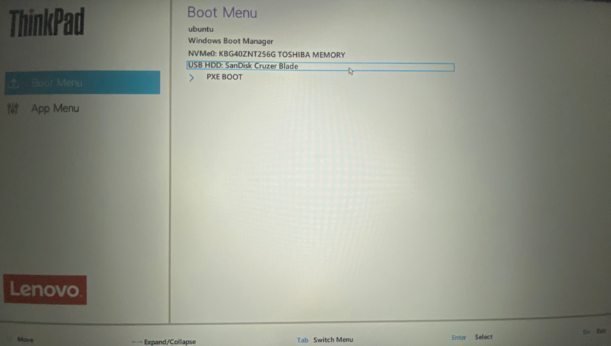

After selecting the USB drive, you will see a screen similar to the one below. 
Click `Install Ubuntu` button.  

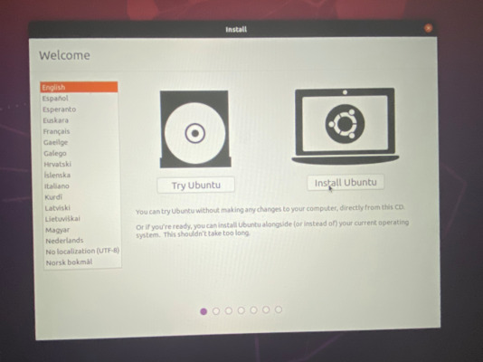

Then choose your keyboard layout as in the image below. (Choose English if you have an English keyboard layout.)

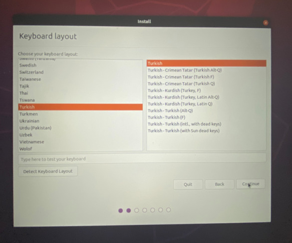

Continue to the installation by clicking the `Normal installation` and `Download updates while installing Ubuntu` options as in the figure below.

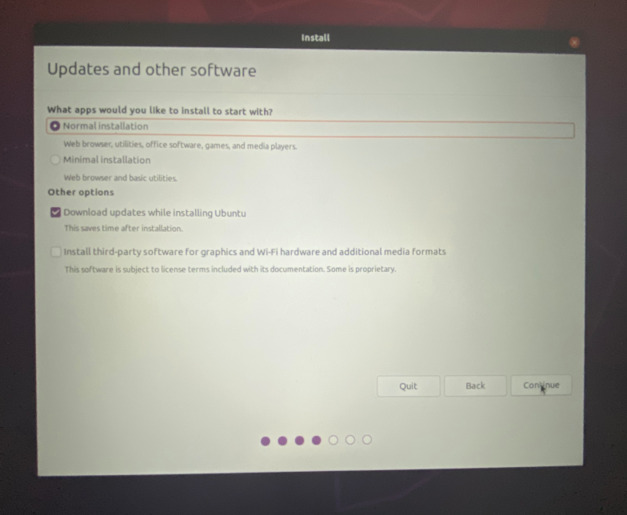

# VERY IMPORTANT STEP
If you choose wrong you might remove everything on your Windows side. Be careful.

Click 

`Install Ubuntu alongside Windows Boot Manager` 

as the installation type and continue.

If you do not see this option, you need to partition your disk using your Windows OS and select `Something else` option below. Search this on the internet. 

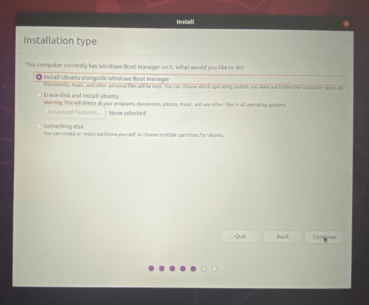

In the next screen, allocate at least 30 GB of space (a larger space pereferable) which we will need in the lessons for Ubuntu. 
To allocate disk space, pull the bidirectional arrow to the right or left.

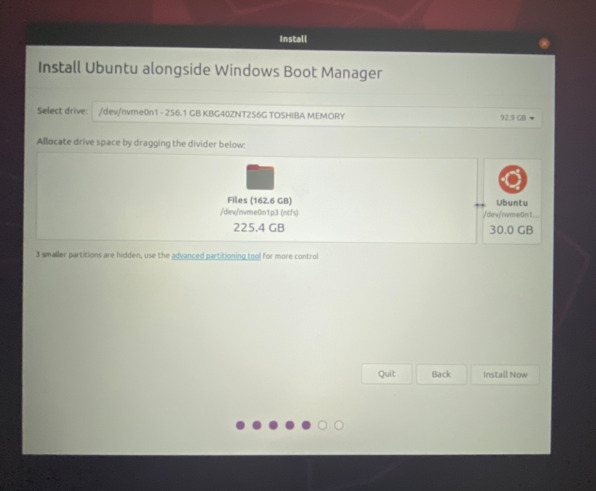

Select your location here.

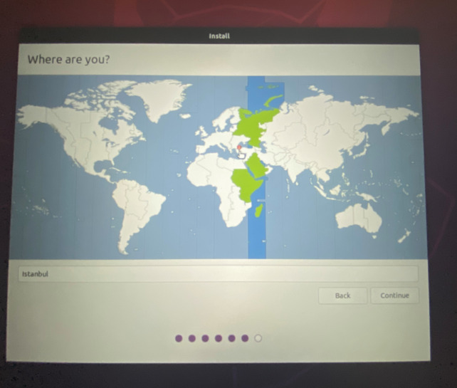

You will see a screen with information such as username, password and computer name as below.
We recommend you to choose a short computer and user names (e.g. la here) and easy-to-type password (e.g. qweqwe) here.

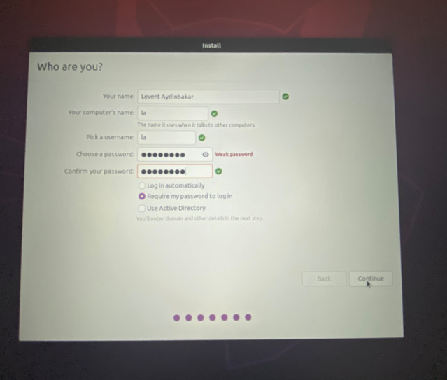

Then wait for some time the installation to complete as in the picture below.

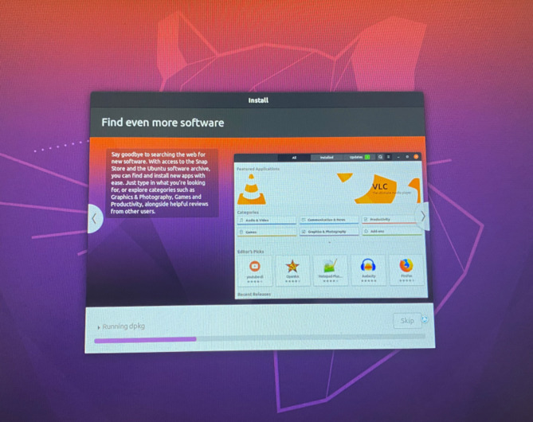

When the installation is complete, click the `Restart Now` button. 

After restart, you will then see a screen like in the image below.
Remove the USB driver and then press the `Enter`. 

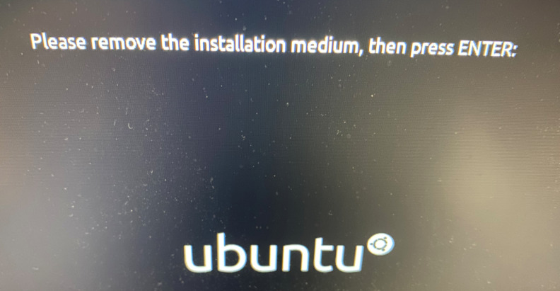

When the computer starts, you will see a screen like in the image below. 

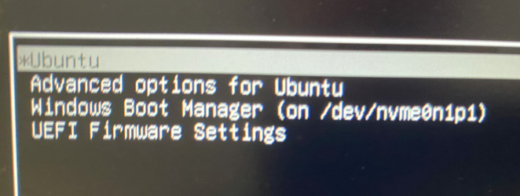

Here, you can select the `Ubuntu` to open Ubuntu, or `Windows Boot Manager` to open Windows. 
If you do not press `Enter` here for 10 seconds Ubuntu starts as default.
You can change this order, to make Windows your default OS. For this, you can find information [here](https://itsfoss.com/grub-customizer-ubuntu/).

