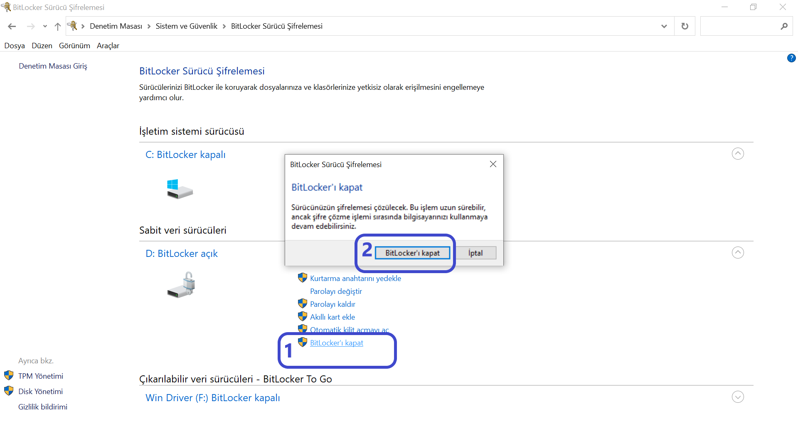

# Turn-off BitLocker 

If your device is new or recently purchased, it may come with BitLocker encryption enabled by default. 
`BitLocker` is a security feature that encrypts the data on your disk to protect it.
However, for the installation process to proceed smoothly, you may need to turn off BitLocker.

Note: If `BitLocker` is not enabled or does not exist on your device, you can skip this step and move on to the next section. 

**To check if `BitLocker` is active, follow these steps:**

- Open `Control Panel` and go to `System and Security`.

- Click on `BitLocker Drive Encryption`.

- If BitLocker is `turned on`, you will see an option to `Turn Off BitLocker`. 

- Click it and follow the prompts to disable it.

If `BitLocker` is not enabled, simply continue with the installation process.

Now that you've ensured `BitLocker` is disabled (if necessary), let’s move on to the installation steps.

## How to Disable BitLocker in Windows: A Step-by-Step Guide

BitLocker is a security feature in the Windows operating system that encrypts your drives to protect your data. 
However, there may be situations where you need to disable BitLocker—for example, when partitioning your disk or installing another operating system. 
Below, we provide a step-by-step guide on how to turn off BitLocker.

### Using the Control Panel to Disable BitLocker

**Step 1:** Access the Control Panel

Click on the Start Menu or press the Windows key on your keyboard.
Type `Control Panel` in the search bar and click on the result that appears.

**Step 2:** Navigate to System and Security Settings

In the Control Panel, click on `System and Security.`

**Step 3:** Open BitLocker Drive Encryption

Find and click on `BitLocker Drive Encryption.`

**Step 4:** `Disable BitLocker`

Next to the drive you want to decrypt, click on `Turn off BitLocker` or `Manage BitLocker.`
In the window that opens, click the `Turn off BitLocker` button.
Confirm the action by clicking `Turn off BitLocker` again.

**Step 5:** Wait for the Decryption Process to Complete

BitLocker will begin decrypting your drive.
This process may take some time, depending on the size of your drive and the amount of data.
Do not turn off your computer or remove the drive during this process.

# Turn-off Secure Boot 

Usually, if Secure Boot is at the enabled mode, it can cause issues during the installation of Ubuntu.

You might encounter an error screen displaying a message like `Security Policy Violation.`

## Reasons for the Error

**Secure Boot Settings:** Secure Boot is a security feature used to ensure that only trusted software and operating systems are loaded during startup.

### Disabling Secure Boot from BIOS Settings

**To disable Secure Boot:** 

- Restart your computer and enter the BIOS/UEFI settings (this is typically done by pressing the F2, F10, Delete, or Esc keys during startup).

- Go to the `Security` or `Boot` tab.

- Find the `Secure Boot` option and set it to  `Disable`.

- Save your changes and exit the BIOS/UEFI settings.

- Restart your computer and check if the error still occurs.

