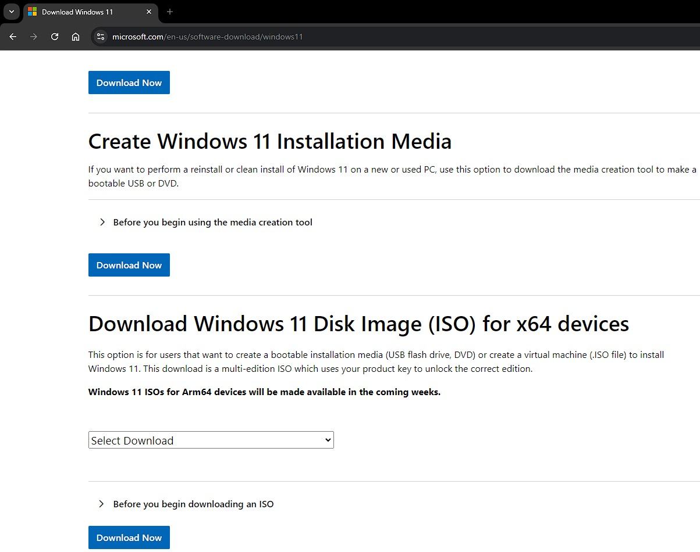
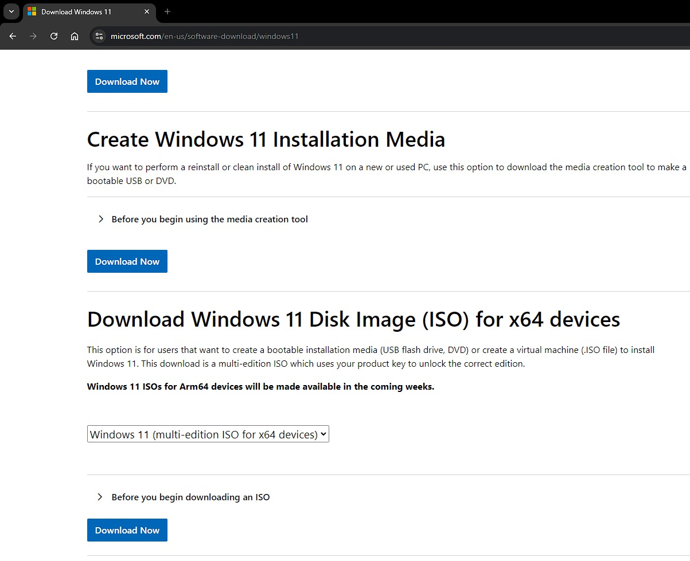
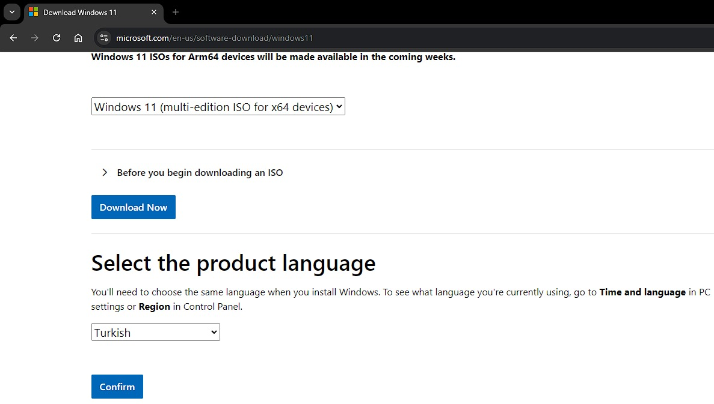
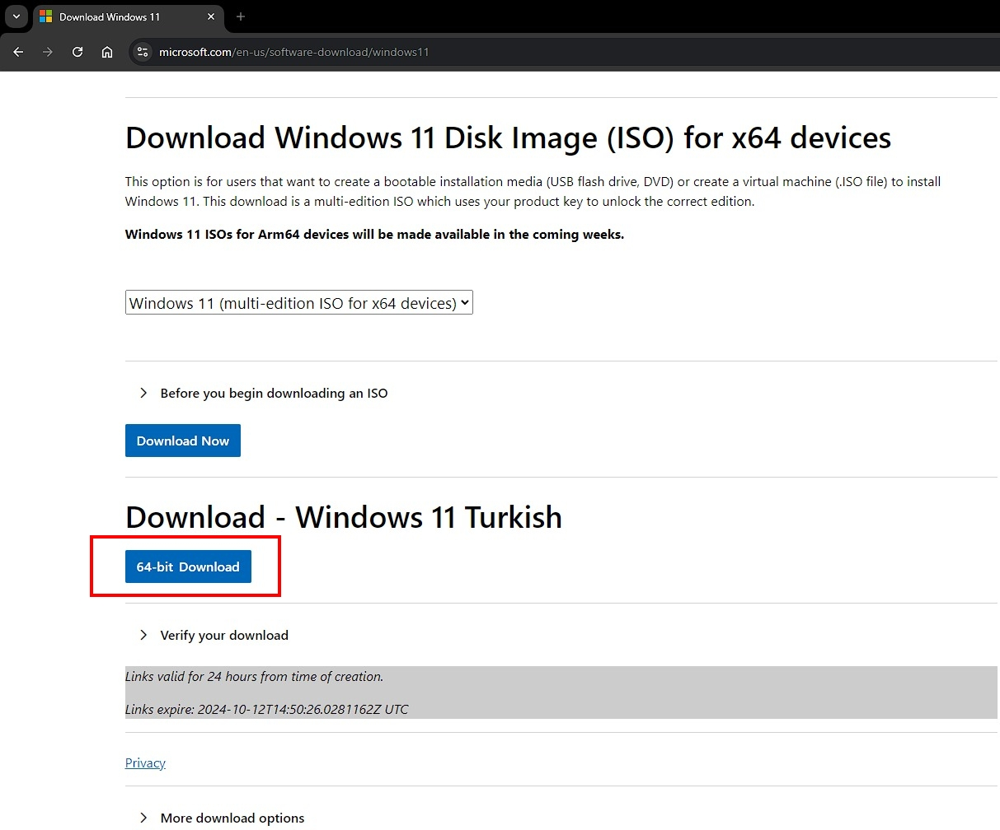
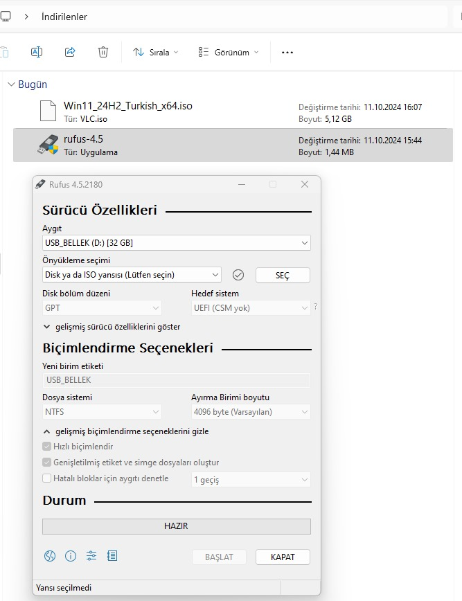
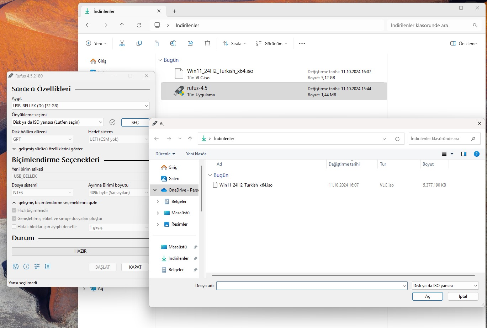
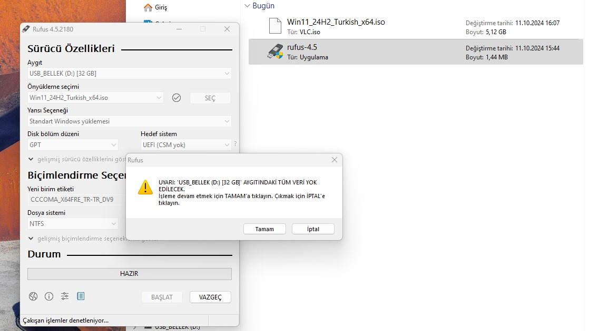
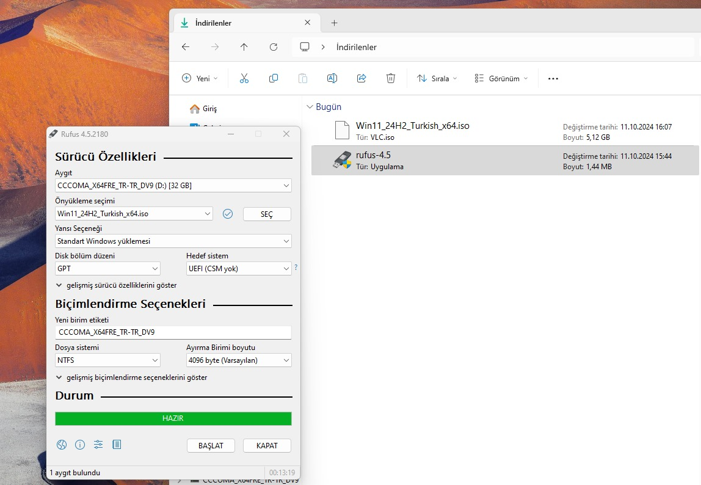

### Download Windows

Visit the official Microsoft website to download the Windows 11 ISO file.

You can download the Windows for free from [this link](https://www.microsoft.com/tr-tr/software-download/windows11). 

Select the option "Windows 11 (multi-edition ISO for x64 devices)" from the download options.

Choose the language for the ISO file and click "Confirm" to proceed.

Select the Windows 11 Turkish ISO file to begin the download process.

Click "Download" to save the Windows 11 ISO file to your computer.

### Write Windows to the Rufus

In Rufus, click the "Select" button to choose the Windows 11 ISO file you downloaded.

Configure Rufus settings to load the Windows 11 ISO as the bootable option.

Choose NTFS as the file system and verify the necessary formatting settings.

Rufus displays a warning that all data on the USB drive will be erased; confirm to continue.

Rufus begins the process of writing the Windows 11 bootable USB drive as in the figure below.

### Installation of Windows
