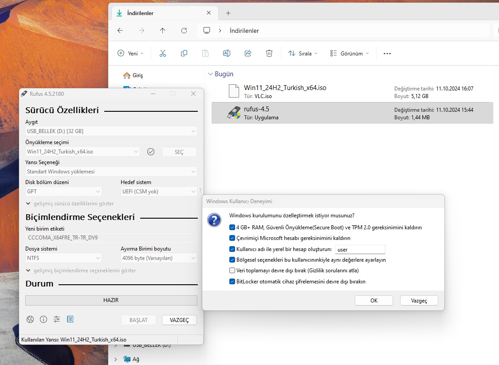

### Download Windows

Visit the official Microsoft website to download the Windows 11 ISO file.

You can download the Windows for free from [this link](https://www.microsoft.com/tr-tr/software-download/windows11). 

Select the option "Windows 11 (multi-edition ISO for x64 devices)" from the download options.

Choose the language for the ISO file and click "Confirm" to proceed.

Select the Windows 11 Turkish ISO file to begin the download process.

Click "Download" to save the Windows 11 ISO file to your computer.

An ISO file will be downloaded.

### Write Windows to the Rufus

In Rufus, click the "Select" button to choose the Windows 11 ISO file you downloaded.

Configure Rufus settings to load the Windows 11 ISO as the bootable option.

Choose NTFS as the file system and verify the necessary formatting settings.

Rufus displays a warning that all data on the USB drive will be erased; confirm to continue.

Rufus begins the process of writing the Windows 11 bootable USB drive as in the figure below.

### Installation of Windows

Select the USB drive from the boot menu to begin installing Windows 11.

Choose the installation language and regional settings.

Select your preferred keyboard layout for input.

Choose the installation option (clean install or repair).

Enter your product key or select "I don't have a product key" to proceed.

Accept the license terms to continue the installation.

Confirm your choice for a clean installation by choosing to erase all files.

Select the disk or partition where Windows 11 will be installed.

At this point, you will see various partitions on your SSD. Some of these partitions (like boot or system partitions) cannot be deleted. 
Delete all partitions that can be removed to create a large Unallocated Space. 
This is important because Windows requires a dedicated partition, and Ubuntu will later need Unallocated Space for installation.

**Important:** 

- Do not delete partitions that are marked as system or boot partitions if you need them for other purposes, like booting from USB.

- Next, from the Unallocated Space, create a new partition for Windows by specifying how much of the space to allocate. 

- Leave a sufficient portion unallocated for Ubuntu installation later. This unallocated space will be recognized automatically when you install Ubuntu.

Select the partition you just created for Windows and proceed with the installation. Leave the unallocated space untouched for Ubuntu.

Windows 11 is now being installed; this process may take some time and include restarts.

Connect to a Wi-Fi network to continue with the setup and download updates.

Choose your privacy settings for location, device tracking, and diagnostic data.

After installation, update Windows 11 to the latest version through Windows Update.

